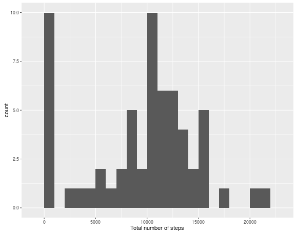
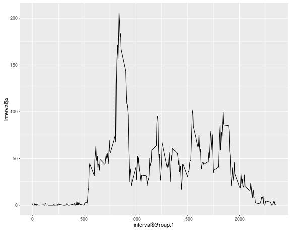
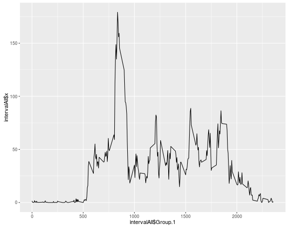

###Loading and preprocessing the data
```
personalActivity = read.csv("activity.csv", header = TRUE, sep =",")
```
###mean total of steps taken per day, ignore NA's

###calculate total of steps per day
```
totalSteps <- tapply(personalActivity$steps, personalActivity$date, FUN=sum, na.rm=TRUE)
```
###Histogram of number of steps per day
```
library(ggplot2)
qplot(totalSteps, binwidth=1000, xlab="Total number of steps")

echo=TRUE
```
###Calculate mean and  median of the total number of steps taken per day
```
mean (totalSteps,na.rm=TRUE)
median(totalSteps,na.rm=TRUE)
echo=TRUE
```
###What is the average daily activity pattern
```
interval <-aggregate(personalActivity$steps, by=list(personalActivity$interval), data=personalActivity, FUN='mean', na.rm=TRUE)

ggplot(data=interval, aes(x = interval$Group.1, y = interval$x))
p <- ggplot(data=interval, aes(x = interval$Group.1, y = interval$x))
p <- p + geom_line()
p
echo = TRUE
```
###which 5 minute interval  max number of steps
```
maxSteps <- aggregate(interval$Group.1, by=list(interval$Group.1), FUN=max)
maxStep <- max(interval)
echo = TRUE
```

###imputing missing values

#Calculate and report missing NA values
```
missingValues = sum(is.na(personalActivity))
```
##create a strategy to fill in missing values
###Since there are days with no data for all the intervals I will use the median obtained for each of the intervals for the missing days

###create new dataset with the missing values all filled in
```
df1 = transform(personalActivity, steps = ifelse(is.na(steps), median(steps, na.rm=TRUE), steps))
echo = TRUE
```

###Histogram of number of steps per day with no missing values
```
totalStepsNo <- tapply(df1$steps, df1$date, FUN=sum, na.rm=TRUE)
library(ggplot2)
qplot(totalStepsNo, binwidth=1000, xlab="Total number of steps")
echo = TRUE
```
###Calculate mean and  median of the total number of steps taken per day
```
mean (totalStepsNo,na.rm=TRUE)
median(totalStepsNo, na.rm=TRUE)
echo =TRUE
```
###Activity patterns
```
library(timeDate)

df1$day <- as.factor(isWeekend(df1$date))

levels(df1$day) <- list(weekday="FALSE", weekend="TRUE")

echo = TRUE
```
###make a panel plot 
```
intervalAll <-aggregate(df1$steps, by=list(df1$interval), data=df1, FUN='mean', na.rm=TRUE)

ggplot(data=intervalAll, aes(x = intervalAll$Group.1, y = intervalAll$x))
p <- ggplot(data=intervalAll, aes(x = intervalAll$Group.1, y = intervalAll$x))
p <- p + geom_line()
p

echo = TRUE
```
###Histogram of total number of steps taken per day


###Mean and median of the total number of steps
#### Mean = 9354.23
#### Median = 10395
###Time series plot of 5 minute interval


### 5 minute interval that has maximum number of steps - 2355

### Number of missing values in data set - 2304

###Mean and Median of data with no missing values
#### Mean = 9354.23
#### Median = 10395

###Histogram with no missing values. Missing values are median of the steps


###Time series plot with no missing values


###The plots do not look different because the median of the steps was taken to fill in the missing values.